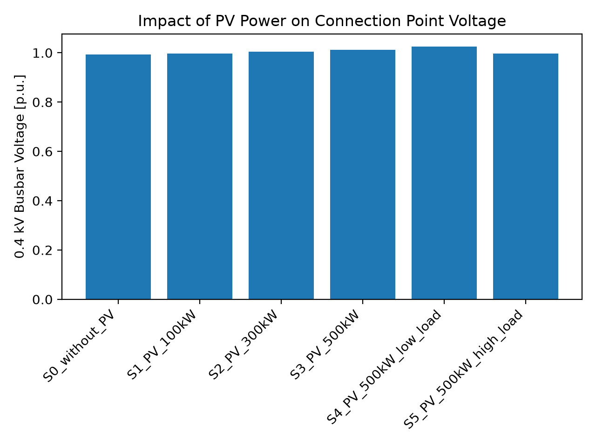
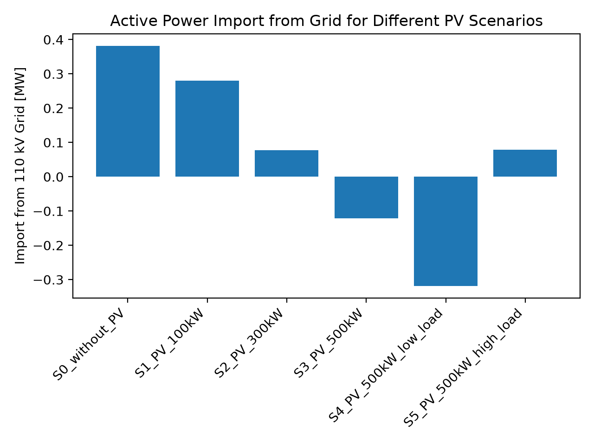
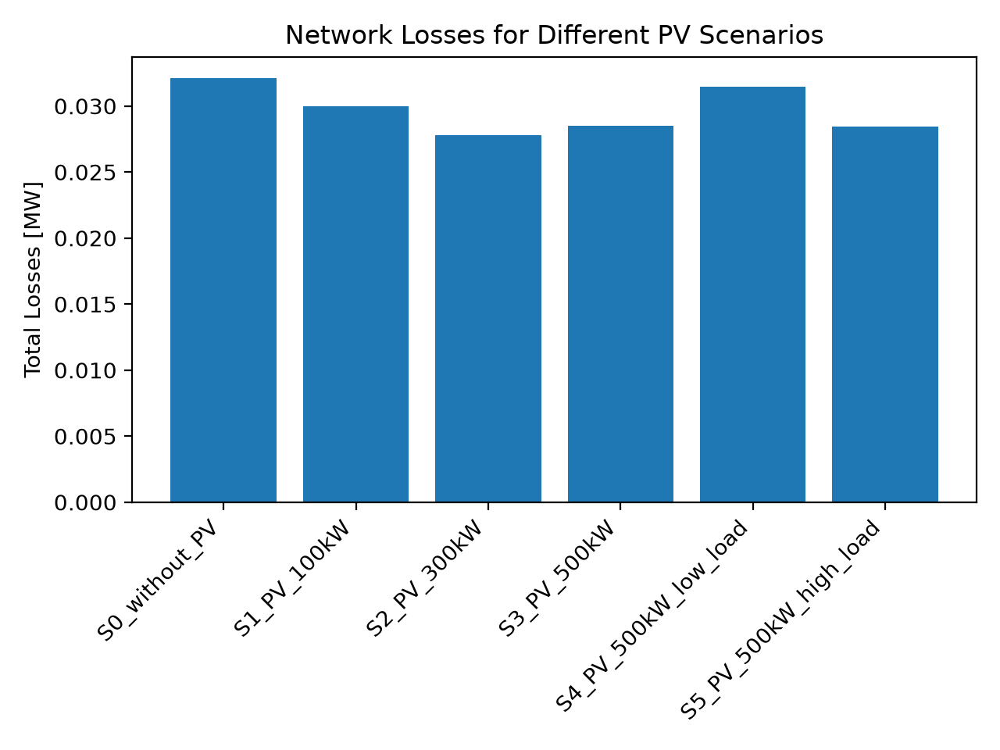
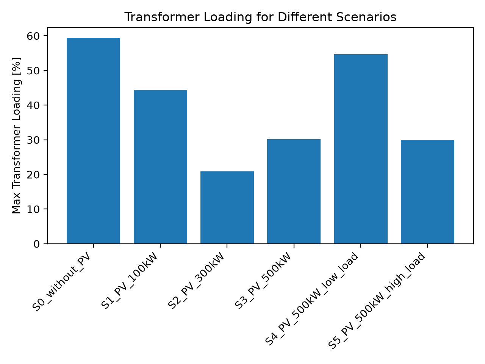
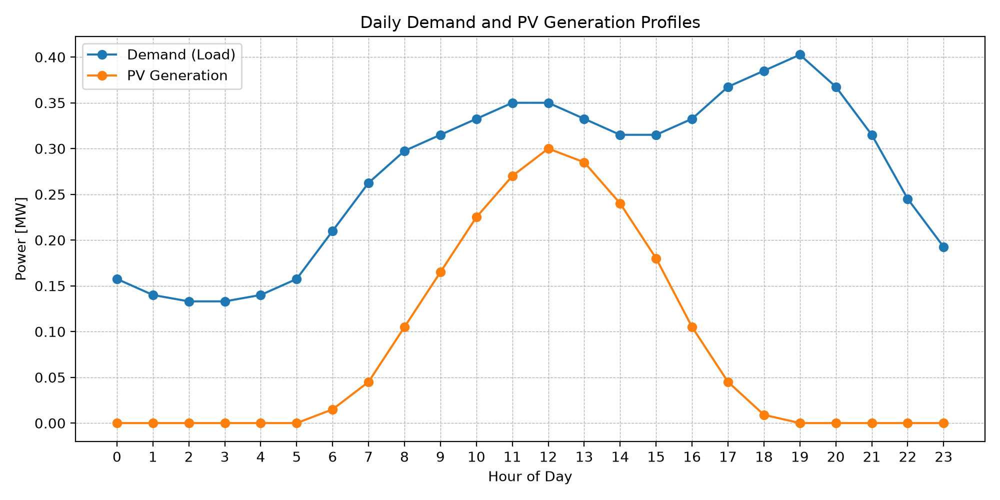
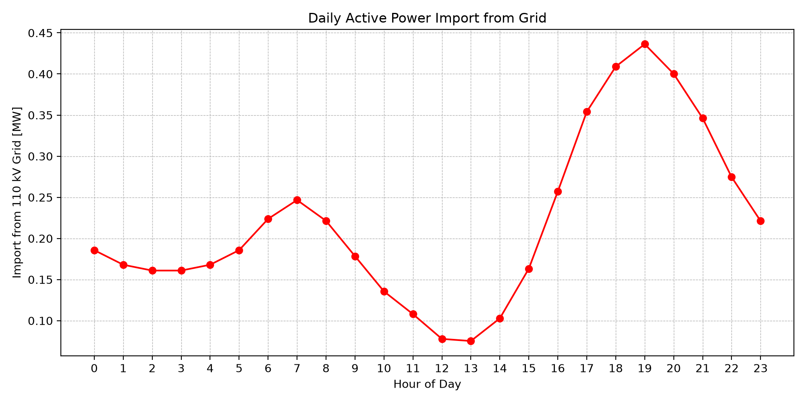
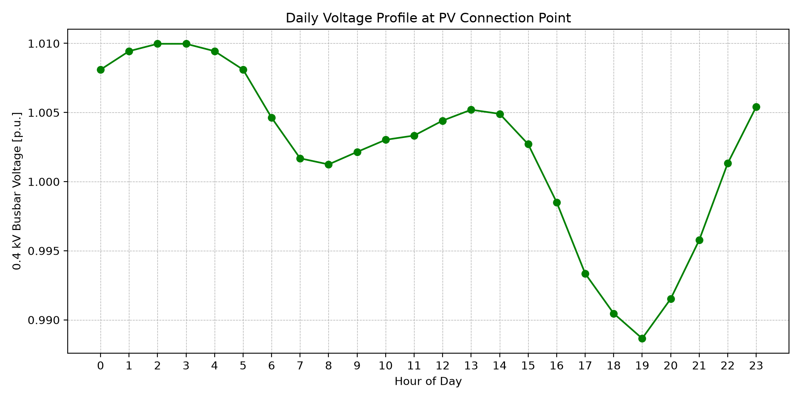
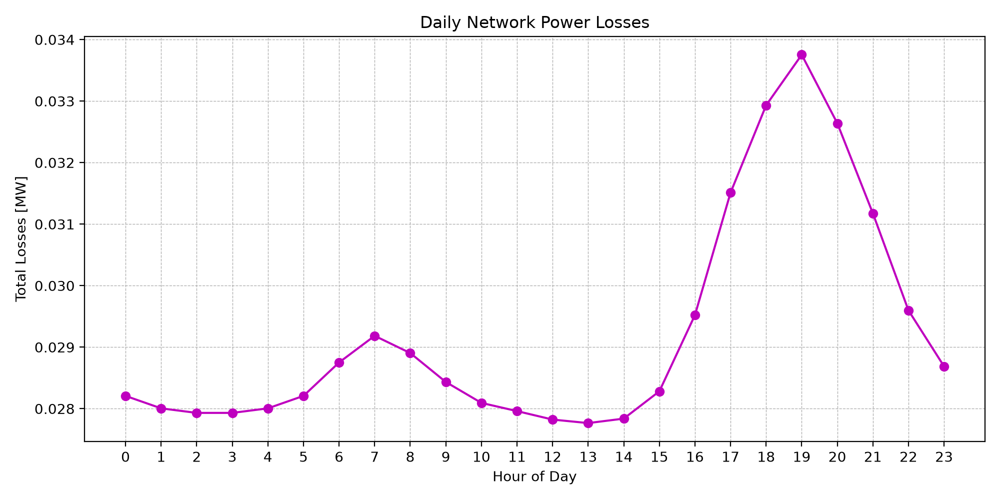
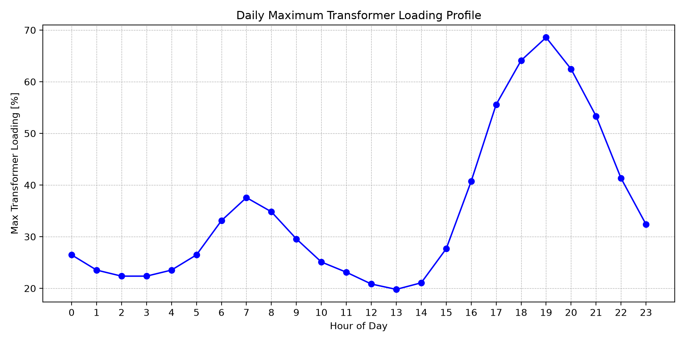

# Techno-Economic and Load-Flow Analysis of a Solar Power Plant Integration into a 110/10/0.4 kV Distribution Network

## 1. Introduction

The objective of this project is to analyze the impact of connecting a photovoltaic (PV) power plant to a simplified 110/10/0.4 kV distribution network. The analysis focuses on voltage profiles, active power import from the external grid, network losses, transformer loading, reverse power flow conditions and a rough economic feasibility assessment.

The project is structured as a junior-level engineering simulation. Python was used as the modeling and data-processing tool, while the main focus of the project is the electrical engineering interpretation of the results.

The analysis does not represent an official grid connection study. Instead, it is intended as a simplified technical model for understanding how distributed PV generation can affect a local distribution network.

---

## 2. Network Model Description

A simplified radial distribution network was modeled with the following structure:

```text
110 kV External Grid
        ↓
110/10 kV Transformer
        ↓
10 kV Substation Busbar
        ↓
10 kV Feeder Line
        ↓
10/0.4 kV Transformer
        ↓
0.4 kV Consumer and PV Connection Point
```

## 3. Assumptions and Methodological Scope

The power system simulation model utilizes simplified parameters for the transformers, transmission lines, load demand and PV generation profiles. The core objective of this study is to isolate and evaluate generalized technical behaviors, sensitivities and grid responses under varying solar integration conditions, rather than replicating a specific utility asset network.

The foundational assumptions governing the simulation include:

- **Balanced System Operation:** The grid is modeled strictly as a symmetrical, three-phase positive-sequence system.
- **Static Load Representation:** The consumer demand is represented dynamically using active ($P$) and reactive ($Q$) power values (PQ node).
- **PV Generation Input:** The photovoltaic facility is modeled as a independent, active power ($P$) injection source.
- **Unity Power Factor Compliance:** The solar PV inverters are assumed to operate at approximately unity power factor ($\cos\varphi \approx 1.0$), meaning no external voltage support or reactive power control is deployed.
- **Exclusion of Control Assets:** Automated line voltage regulators and transformer On-Load Tap Changers (OLTC) are not included in the steady-state model execution.
- **Synthetic Asset Mapping:** The network configuration relies on simplified baseline assumptions rather than real, proprietary utility distribution datasets.
- **Excluded Boundary Studies:** Overcurrent protection schemes, relay coordination and short-circuit fault conditions are excluded from the scope of this steady-state analysis.

## 4. Steady-State Load-Flow Analysis

A static load-flow analysis was performed to see how the distribution network handles different levels of solar power under different load conditions. The simulation includes six distinct scenarios.

### 4.1 Scenario Matrix

| Scenario ID | System Designation      | PV Capacity (kW) | Network Demand Level  | Core Analytical Purpose                                                                  |
| :---------- | :---------------------- | :--------------: | :-------------------- | :--------------------------------------------------------------------------------------- |
| **S0**      | `S0_without_PV`         |        0         | Nominal Base Load     | Shows how the network operates under normal conditions before adding solar.              |
| **S1**      | `S1_PV_100kW`           |       100        | Nominal Base Load     | Checks the system behavior with a small amount of solar power added.                     |
| **S2**      | `S2_PV_300kW`           |       300        | Nominal Base Load     | Tests a medium-sized solar plant that matches normal local power needs.                  |
| **S3**      | `S3_PV_500kW`           |       500        | Nominal Base Load     | Tests a large solar plant to see if excess power starts feeding back into the grid.      |
| **S4**      | `S4_PV_500kW_low_load`  |       500        | Minimum Off-Peak Load | Checks the high-risk situation of maximum solar generation during low electricity usage. |
| **S5**      | `S5_PV_500kW_high_load` |       500        | Maximum Peak Load     | Checks if the network and transformers can handle heavy power stress during high usage.  |

## 4. Simulation Results and Discussion

### 4.1 Voltage at the 0.4 kV Busbar

The results show that the voltage at the 0.4 kV busbar changes slightly as PV capacity increases.

Higher PV capacity causes a small voltage rise, especially under the 500 kW PV low-load scenario. This happens because local PV generation exceeds local demand, forcing surplus power to be pushed back toward the upstream grid. However, the voltage remains close to 1.0 p.u. in all analyzed scenarios. Therefore, no voltage violations are observed in this simplified model.



### 4.2 Active Power Import from the Grid

The active power import decreases as PV capacity increases.

Without PV, the local load is supplied entirely from the external grid. With 100 kW and 300 kW PV systems, part of the local demand is supplied by the PV plant, which reduces grid import. In the 500 kW PV scenarios, the active power import becomes negative. This means that PV generation exceeds local demand and surplus power is exported back toward the upstream grid, creating a reverse power flow. The strongest reverse power flow occurs in the 500 kW low-load scenario.



### 4.3 Network Losses

Losses decrease when PV generation is used locally, but they do not decrease continuously with higher PV capacity.

The 300 kW PV scenario gives the lowest losses in this model. This indicates a good balance between local generation and local consumption. With a 500 kW PV system, especially under low-load conditions, losses increase again because excess power is exported back through the transformer and feeder. This creates additional current flow and increases losses. Therefore, the largest PV capacity is not automatically the best technical solution.



### 4.4 Transformer Loading

Transformer loading decreases when PV generation covers part of the local load.

The 300 kW PV scenario gives the lowest transformer loading. In this case, PV production significantly reduces the amount of power that must pass from the external grid to the consumer. For the 500 kW PV scenarios, transformer loading increases again due to reverse power flow. The transformer experiences thermal loading both when supplying the consumer from the grid and when transferring surplus PV energy back toward the grid. In all analyzed scenarios, transformer loading remains safely below 100%.



## 5. 24-Hour Simulation

A simplified 24-hour simulation was performed for the 300 kW PV configuration.

The load profile has:

- lower demand during the night,
- increasing demand in the morning,
- peak demand in the evening.

The PV profile has:

- zero production at night,
- increasing production in the morning,
- maximum production around noon,
- decreasing production in the afternoon.

### 5.1 Daily Load and PV Generation



PV generation reaches its maximum around noon, while the highest consumer demand occurs in the evening.

This means that PV generation reduces grid import during the day, but it does not cover the evening peak because PV production is zero at that time.

### 5.2 Daily Active Power Import



Grid import is lowest around noon, when PV generation is highest.

In the evening, PV generation drops to zero while demand reaches its maximum. Therefore, the highest grid import occurs during evening hours.

This shows that PV reduces daytime dependency on the grid, but the evening peak still requires supply from the external network.

### 5.3 Daily Voltage Profile



The voltage at the 0.4 kV busbar remains close to 1.0 p.u. throughout the day.

The lowest voltage occurs in the evening, when demand is highest and PV generation is zero. During daylight hours, PV generation helps support the local voltage by reducing power import through upstream elements.

No voltage violation occurs in the analyzed daily simulation.

### 5.4 Daily Network Losses



Network losses are lower when PV generation supplies part of the local demand.

The highest losses occur in the evening, when load demand is highest and all power must be imported from the grid. This is expected because higher current through lines and transformers causes higher losses.

### 5.5 Daily Transformer Loading



Transformer loading decreases during periods of high PV generation and increases during the evening peak.

The maximum transformer loading occurs in the evening, when PV generation is zero and demand is highest. In this model, transformer loading remains below 100% during the whole day.

## 6. Economic Assessment

A rough economic assessment was performed for the 300 kW PV system configuration.

### 6.1 Parameter Overview

| Parameter                 | Value             |
| :------------------------ | :---------------- |
| Installed PV capacity     | 300 kW            |
| Specific annual yield     | 1,200 kWh/kW/year |
| Annual PV generation      | 360,000 kWh/year  |
| Self-consumption ratio    | 75%               |
| Self-consumed energy      | 270,000 kWh/year  |
| Electricity price         | 0.18 KM/kWh       |
| Investment cost           | 1,400 KM/kW       |
| Total investment cost     | 420,000 KM        |
| Estimated annual savings  | 48,600 KM/year    |
| **Simple payback period** | **8.6 years**     |

### 6.2 Mathematical Calculations

The economic indicators are derived using the following basic steps:

1. **Annual Generation:**
   $$\text{Annual Generation} = 300\text{ kW} \times 1,200\text{ kWh/kW/year} = 360,000\text{ kWh/year}$$

2. **Self-Consumed Energy:**
   $$\text{Self-Consumed Energy} = 360,000\text{ kWh/year} \times 0.75 = 270,000\text{ kWh/year}$$

3. **Estimated Annual Savings:**
   $$\text{Annual Savings} = 270,000\text{ kWh/year} \times 0.18\text{ KM/kWh} = 48,600\text{ KM/year}$$

4. **Simple Payback Period:**
   $$\text{Simple Payback} = \frac{420,000\text{ KM}}{48,600\text{ KM/year}} \approx 8.6\text{ years}$$

### 6.3 Assessment Limitations

This analysis represents only a rough, order-of-magnitude estimation. To maintain a simplified framework for this project portfolio, the calculations exclude operational and maintenance costs (O&M), panel degradation rates, inverter replacements, financing interests, localized taxes, potential utility tariff variations and any grid-export financial compensations.

## 7. Discussion

The analysis shows that PV integration reduces active power import from the external grid and can reduce network losses when the generated energy is consumed locally.

The 300 kW PV scenario appears to be the most balanced case in this simplified model. It significantly reduces grid import, gives the lowest losses and reduces transformer loading without causing strong reverse power flow.

The 500 kW PV scenario reduces grid import further, but it also creates reverse power flow, especially under low-load conditions. This can increase transformer loading and network losses.

The voltage results show a slight voltage rise with larger PV capacities, but no voltage violation occurs in this model.

Overall, the technically best PV size is not necessarily the largest one. It depends entirely on the balance between local demand, PV generation, losses, voltage levels, transformer loading and reverse power flow dynamics.

## 8. Conclusion

The integration of a PV power plant into a simplified 110/10/0.4 kV distribution network can reduce active power import from the external grid and support local consumption.

In this model, the 300 kW PV configuration provides the most balanced technical result. It reduces grid import, lowers network losses and decreases transformer loading while maintaining acceptable voltage levels.

The 500 kW PV configuration produces more energy, but it can cause severe reverse power flow under normal and low-load conditions. This shows that the largest PV size is not automatically the most suitable technical choice.

The 24-hour simulation shows that PV generation is most useful during daylight hours, especially around noon. However, the evening peak demand still depends completely on the external grid because PV production is zero at that time.

For real-world implementation, the analysis should be expanded with actual network data, short-circuit calculations, protection coordination, voltage control strategies, inverter behavior and local grid code requirements.
